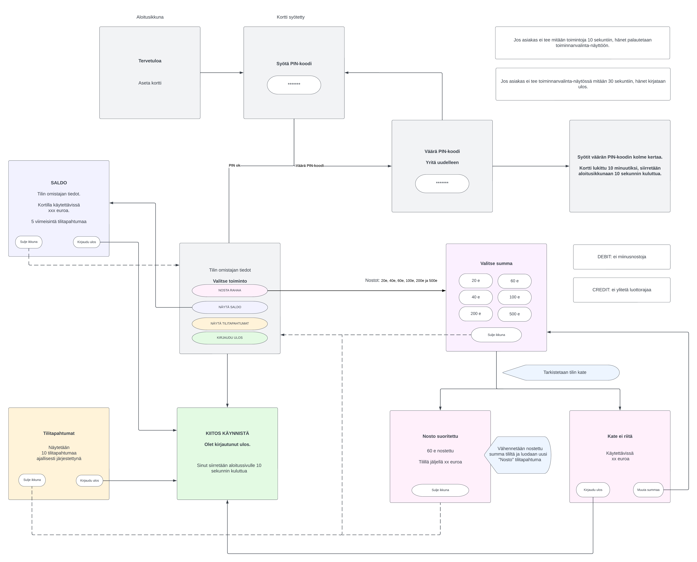
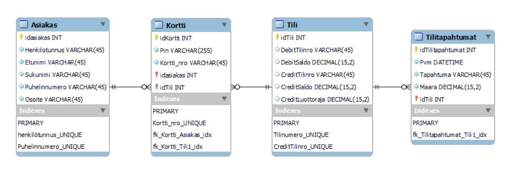

# BankSimul-projekti: group_8

Projektissa suunnitellaan ja toteutetaan pankkiautomaattisimulaattori (BankSimul), jolla voidaan simuloida pankkiautomaatin perustoimintoja: rahan nosto, saldon ja tilipahtumien tarkasteleminen. Kohdejärjestelmän arkkitehtuuri on asiakas-palvelin (client-server).

Projektissa käytetään RFID-kortteja (OLIMEXRFID125-KEY) ja RFID-kortinlukijaa (OLIMEX-MOD-RFID125) simuloimaan pankki-/luotto-/kaksoiskortteja. 

Kohdejärjestelmän tietokoneessa suoritettava BankSimul-ohjelma koostuu Exe- ja DLL-komponenteista (DLL_rfid, pinUIDLL, RestApiDLL). Kohdejärjestelmän ohjelmistokomponenttien toteuttamiseen käytetään Qt-ohjelmointiympäristöä, sen luokkakirjaston luokkia ja tapahtumapohjaista sovelluskehitystä.

Palvelintietokoneella on käytössä MySQL-palvelinohjelmisto, Node.js-ajoympäristo ja RestApi.

Tiedonsiirto kohdejärjestelmän tietokoneen ja palvelintietokoneen välillä toteutetaan http-protokollalla.

## Projektin aikana käytetyt ohjelmistot, käyttöjärjestelmät, ohjelmointi- ja ajoympäristöt:
    - Windows 11
    - Qt-ohjelmointiympäristö
    - Visual Studio Code -ohjelmointiympäristö
    - Git ja GitHub
    - UniServerZ (15.0.1)
    - MySQL Workbench (8.0)
    - Postman
    - Node.js
    - RestApi

## Projektin työnjako
Suunnittelimme yhdessä pankkisimulaattorin tietokannan ja käyttöliittymän. Tuulikki alusti GitHub-repositoryn ja teki ensimmäisen version tietokannan ER-diagrammista. ER-diagrammi katselmoitiin ja kaikki tiimin jäsenet tekivät siihen muutoksia tarpeen mukaan. 

Teimme yhdessä alkuperäiset RestApin CRUD-operaatiot. Saana teki RestApin loginin ja Postmanin käyttöönoton. Niina teki muutoksia CRUD-operaatioihin BankSimul-ohjelmaa varten. 

Tuulikki teki pinUIDLL:n, Saana DLL_rfid:n ja Niina RestApiDLL:n.

Niina teki tietokantaan näkymiä ja aliohjelman, joka tarkistaa tilin saldon riittävyyden uuden tilitapahtuman lisäämisen yhdeydessä. Tätä aliohjelmaa käytetään "Nosta rahaa" -toiminnossa backendin puolella. Tuulikki toteutti toiminnon frontendin puolella.

Saana lisäsi kaikkiin käyttöliittymän ikkunoihin ajastimet, teki uloskirjautumistoiminnot ja yhtenäisti käyttöliittymän ulkoasun. Kaikki tekivät koodien yhdistämistä ja debuggausta. Kaikki osallistuivat dokumenttien tekoon.

## UI suunnitelma

Pankkiautomaatin käyttöliittymä on seuraavanlainen:

## ER-diagrammi

Asiakkaalla voi olla olemassa 0, 1 tai useita tilejä ja/tai kortteja. 
Korttia ei voi olla olemassa ilman asiakasta ja tiliä. Kortti voi olla joko debit tai credit. Korttityyppi määräytyy tili-taulun kautta. Mikäli credit-attribuutit palauttavat arvon NULL, niin kyseessä on debit-kortti ja päinvastoin. 
